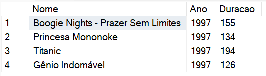

# Filmes
## Montando Consultas Relacionais no Microsoft SQL Server

### Author: Macedo, Glener Diniz - Desenvolvedor Full Stack
### Data.: 8 de julho de 2025.

### Orientador:
Leonardo Buta - Full-Stack

  

## Desafio de projeto
Para este desafio, precisamos usar seus conhecimentos adquiridos no módulo de banco de dados.

## Contexto
De forma que na missão de DBA, o responsável pelo banco de dados de um site de filmes, onde são armazenados dados sobre os filmes e seus atores. Sendo assim, foi solicitado para que realizamos uma consulta no banco de dados com o objetivo de trazer alguns dados para análises.

  

## Proposta
Apresentamos na prática a realização de 12 consultas ao banco de dados, cada uma retornando um tipo de informação.
De modo que o banco de dados foi modelado da seguinte maneira, conforme o diagrama:

As tabelas sao descritas conforme a seguir:

**Filmes**

Tabela responsável por armazenar informações dos filmes.

**Atores**

Tabela responsável por armazenar informações dos atores.

**Generos**

Tabela responsável por armazenar os gêneros dos filmes.

**ElencoFilme**

Tabela responsável por representar um relacionamento do tipo muitos para muitos entre filmes e atores, ou seja, um ator pode trabalhar em muitos filmes, e filmes
podem ter muitos atores.

**FilmesGenero**

Tabela responsável por representar um relacionamento do tipo muitos para muitos entre filmes e gêneros, ou seja, um filme pode ter mais de um gênero, e um genêro pode fazer parte de muitos filmes.

## Preparando o banco de dados
Executando o arquivo **Script Filmes.sql** no banco de dados SQL Server, presente na pasta Scripts deste repositório ([ou clique aqui](Script%20Filmes.sql)). Esse script irá criar um banco chamado **Filmes**, contendo as tabelas e os dados necessários para você realizar este desafio.

## Objetivo
Com o objetivo de criar diversas consultas, e de retornar os dados a seguir. Abaixo de cada pedido tem o retorno esperado. O seu retorno deve ser igual ao da imagem.

## 1 - Buscar o nome e ano dos filmes
SELECT Nome, Ano From Filmes

## 2 - Buscar o nome e ano dos filmes, ordenados por ordem crescente pelo ano
SELECT Nome, Ano, Duracao From Filmes ORDER BY Ano 

## 3 - Buscar pelo filme de volta para o futuro, trazendo o nome, ano e a duração
SELECT Nome, Ano, Duracao From Filmes WHERE Nome='de volta para o futuro'  

## 4 - Buscar os filmes lançados em 1997
SELECT Nome, Ano, Duracao From Filmes WHERE Ano=1997 

## 5 - Buscar os filmes lançados APÓS o ano 2000
SELECT Nome, Ano, Duracao From Filmes WHERE Ano>2000 

## 6 - Buscar os filmes com a duracao maior que 100 e menor que 150, ordenando pela duracao em ordem crescente
SELECT Nome, Ano, Duracao From Filmes WHERE Duracao>100 and Duracao<150 ORDER BY Duracao

## 7 - Buscar a quantidade de filmes lançadas no ano, agrupando por ano, ordenando pela duracao em ordem decrescente
SELECT Ano, COUNT(*) Quantidade From Filmes GROUP BY ANO ORDER BY Quantidade DESC

## 8 - Buscar os Atores do gênero masculino, retornando o PrimeiroNome, UltimoNome
SELECT Id, PrimeiroNome, UltimoNome, Genero FROM Atores WHERE Genero = 'M'

## 9 - Buscar os Atores do gênero feminino, retornando o PrimeiroNome, UltimoNome, e ordenando pelo PrimeiroNome
SELECT Id, PrimeiroNome, UltimoNome, Genero FROM Atores WHERE Genero = 'F' ORDER BY PrimeiroNome

## 10 - Buscar o nome do filme e o gênero
SELECT Flme.Nome AS 'Nome do Filme', Gnro.Genero AS 'Nome do Genero'
       FROM Filmes Flme
       JOIN FilmesGenero flmeGnero ON Flme.Id = flmeGnero.IdFilme
       JOIN Generos Gnro ON Gnro.Id = flmeGnero.idGenero;

## 11 - Buscar o nome do filme e o gênero do tipo "Mistério"
SELECT Flme.Nome AS 'Nome do Filme', Gnro.Genero AS 'Nome do Genero'
FROM Filmes Flme
JOIN FilmesGenero flmeGnero ON Flme.Id = flmeGnero.IdFilme
JOIN Generos Gnro ON Gnro.Id = flmeGnero.idGenero
WHERE Genero = 'Mistério';

## 12 - Buscar o nome do filme e os atores, trazendo o PrimeiroNome, UltimoNome e seu Papel
SELECT Flme.Nome, Atres.PrimeiroNome 'Primeiro Nome', Atres.UltimoNome 'Ultimo Nome', ElncoFlme.Papel
FROM Filmes Flme
INNER JOIN ElencoFilme ElncoFlme ON Flme.Id = ElncoFlme.IdFilme
INNER JOIN Atores Atres ON Atres.Id = ElncoFlme.IdAtor

